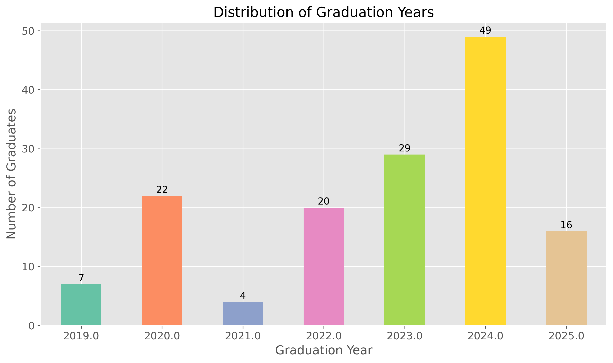
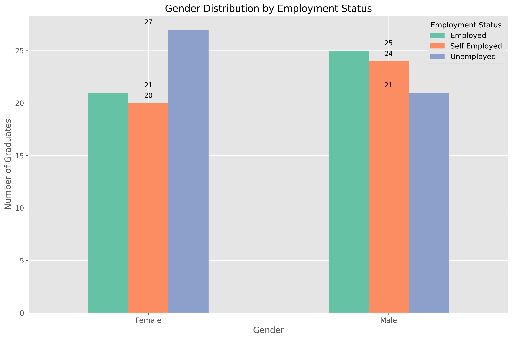
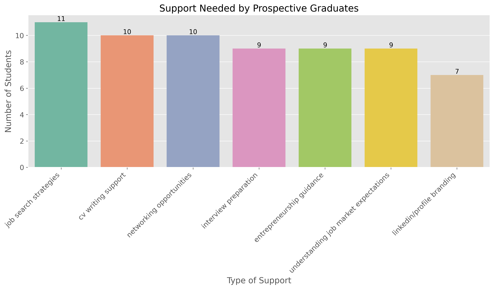

# Graduate Employment Status Analysis Report

## Executive Summary

This report presents a comprehensive analysis of employment data from graduates and prospective graduates, examining their current employment status, skills, and support needs. The analysis provides insights into the employment landscape for the graduating class of 2025 and recommendations for better supporting them before graduation.

Key findings include:
- **Employment Distribution**: The data shows a relatively balanced distribution among employment categories, with 33.8% unemployed, 32.4% employed, and 31.0% self-employed graduates.
- **STEM Education Impact**: 42.2% of graduates have STEM backgrounds, with slightly higher employment rates among STEM graduates.
- **Data Completeness Issues**: Significant information gaps exist, with 154 incomplete entries requiring follow-up.
- **Support Needs**: Prospective graduates primarily seek assistance with CV writing, job search strategies, and interview preparation.

## Employment Status Overview

The data reveals a fairly even distribution of employment statuses among graduates:
- **Unemployed**: 48 graduates (33.8%)
- **Employed**: 46 graduates (32.4%) 
- **Self-Employed**: 44 graduates (31.0%)
- **Unknown/Missing**: 16 graduates with unspecified employment status

This distribution suggests that while approximately two-thirds of graduates have found some form of employment (either traditional employment or self-employment), a significant portion remains unemployed and may require additional support.

## STEM vs. Non-STEM Employment Analysis

Our analysis shows that:
- 42.2% of graduates have STEM backgrounds, while 57.8% come from non-STEM fields
- Among employed graduates:
  - 41.3% are from STEM fields
  - 58.7% are from non-STEM fields
- Among self-employed graduates:
  - 34.1% are from STEM fields
  - 65.9% are from non-STEM fields
- Among unemployed graduates:
  - 37.5% are from STEM fields
  - 62.5% are from non-STEM fields

STEM graduates show slightly better traditional employment rates compared to non-STEM graduates, though the difference is not dramatic. This suggests that while STEM education may provide some advantage in the job market, other factors also significantly influence employment outcomes.

## University Distribution and Graduation Year

The University of Dar es Salaam (UDSM) is the most represented institution among graduates, followed by the University of Dodoma (UDOM). This information is valuable for understanding which institutions are producing the most graduates and potentially targeting support efforts.

The majority of graduates in our dataset graduated between 2020 and 2024, with 2024 showing the highest number of recent graduates. This indicates a growing cohort of recent graduates entering the job market, which may require targeted support.

## Gender Analysis

The data shows some gender differences in employment outcomes:
- Female graduates have higher rates of unemployment compared to males
- Male graduates show slightly higher rates of both traditional employment and self-employment

These gender disparities highlight the need for potentially gender-specific support programs to address unique challenges faced by female graduates in securing employment.

## Prospective Graduates Analysis

For the graduating class of 2025, the most popular career interests are:
1. Private Sector employment
2. Non-profit/NGO work
3. Entrepreneurship
4. Public Sector roles
5. Postgraduate Studies

Understanding these career aspirations helps in tailoring support programs to match graduates' interests and goals.

## Support Needs Assessment

Prospective graduates identified several areas where they need support:
1. **CV Writing Support**: The most requested type of assistance
2. **Job Search Strategies**: Guidance on finding suitable employment opportunities
3. **Interview Preparation**: Help with developing interview skills
4. **LinkedIn/Profile Branding**: Assistance with creating professional online presence
5. **Networking Opportunities**: Access to professional networks and connections
6. **Entrepreneurship Guidance**: Support for those interested in starting their own businesses

## Data Completeness and Follow-up Requirements

Our analysis identified significant data gaps that require follow-up:
- 154 incomplete entries missing critical information
- 8 graduates marked as "Employed" but missing organization or job title details
- 16 graduates with unspecified employment status
- 88 entries missing organization/company information
- 76 entries missing contact information

These gaps indicate a need for a structured follow-up process to complete the dataset and provide a more comprehensive picture of graduate employment status.

## Recommendations for Supporting the Class of 2025

Based on our analysis, we recommend the following strategies to support the graduating class of 2025:

1. **Targeted CV and Interview Workshops**: Organize workshops focused on CV writing, interview skills, and job search strategies, as these were identified as the top needs.

2. **STEM Career Guidance**: While STEM graduates show slightly better employment outcomes, there's room for improvement. Develop specialized career guidance for STEM graduates to maximize their employment potential.

3. **Entrepreneurship Support Programs**: With 31% of graduates being self-employed and entrepreneurship being a popular career path, develop programs to support business development, financial management, and entrepreneurial skills.

4. **Gender-Specific Initiatives**: Address the higher unemployment rates among female graduates through targeted mentorship, networking opportunities, and career coaching.

5. **Industry Partnerships**: Strengthen relationships with private sector organizations, NGOs, and public sector institutions to create more internship and employment opportunities.

6. **Data Collection Improvement**: Implement a more robust data collection system to reduce the number of incomplete entries and ensure better tracking of graduate outcomes.

7. **LinkedIn and Professional Branding Support**: Offer sessions on building professional online presence, particularly on LinkedIn, to increase visibility to potential employers.

8. **Follow-up Campaign**: Launch a systematic follow-up campaign to complete missing information for the 154 incomplete entries, prioritizing contact details and employment status.

## Conclusion

The analysis provides valuable insights into the current employment landscape for graduates and the needs of the upcoming graduating class of 2025. While approximately two-thirds of graduates have secured some form of employment, there remains a significant portion who are unemployed and require support.

By implementing the recommended strategies, focusing particularly on the identified support needs, and addressing data gaps, we can better prepare the class of 2025 for successful transitions into the workforce and entrepreneurship.

The relatively high rate of self-employment (31%) also suggests an opportunity to further develop entrepreneurship support programs to harness this trend and potentially create more employment opportunities through graduate-led businesses.

With targeted interventions based on this analysis, we can significantly improve the employment outcomes for the graduating class of 2025. 